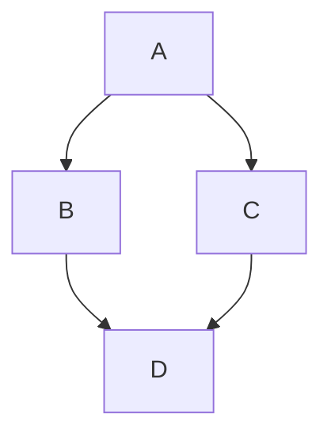

# tests-mermaids



```mermaid
flowchart TD

    subgraph producteurs["producteurs"]
        agriculteurs("agriculteurs")
        éleveurs["éleveurs"]
    end

    subgraph structures["structures"]
        abattoir["abattoir"]
        huilerie["huilerie"]
    end

    subgraph grossiste["grossiste"]
        boucher["boucher"]
        maraîcher["maraîcher"]
    end

    subgraph Restaurants["Restaurants"]
        cuisinier["cuisinier"]
        serveur["serveur"]
    end

    client

    producteurs -->|vend| Restaurants
    agriculteurs -->|vend| huilerie
    éleveurs -->|vend| abattoir
    agriculteurs --> maraîcher
    huilerie -->|vend| grossiste

    client <-.->|commande| serveur
    serveur -.->|commande du client| cuisinier

    abattoir -->|carcasse| boucher
    marécher --> Restaurants
    boucher --> Restaurants

    cuisinier -->|plat| serveur
    serveur -->|plat| client
